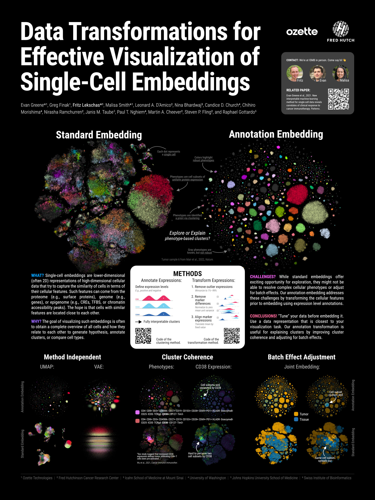

# ISMB BioVis '22 Talk on Data Transformations for Effective Visualization of Single-Cell Embeddings

[](https://zenodo.org/badge/latestdoi/496748272)
[](https://youtu.be/BSGQZIiVwtY)

This repository contains the code to reproduce plots presented in our BioVis talk+poster at ISMB '22. [The talk itself is available on YouTube.](https://youtu.be/BSGQZIiVwtY)

<p float="left">
   <a href="slides.pdf">
      <figure>
        
      </figure>
   </a>
   <a href="poster.jpg">
      <figure>
        
      </figure>
   </a>
</p>

For a much more elaborate R implementation that includes our FAUST clustering method, please take a look at https://github.com/RGLab/FAUST.

For details about our clustering and visualization methods, please take a look at the related publication:

> [Greene et al., 2021, New interpretable machine-learning method for single-cell data reveals correlates of clinical response to cancer immunotherapy. _Pattern_.](https://www.sciencedirect.com/science/article/pii/S2666389921002348)

## Requirements

- [Conda](https://github.com/conda-forge/miniforge)

## Install

```
git clone git@github.com:flekschas-ozette/ismb-biovis-2022.git
cd ismb-biovis-2022
conda env create -f environment.yml
conda activate ozette-ismb-biovis-2022
```

## Example Data

Download the example data from https://figshare.com/articles/dataset/ISMB_BioVis_2022_Data/20301639 and place the files under `data/mair-2022`. The data is from [Mair et al., 2022, Extricating human tumour immune alterations from tissue inflammation, _Nature_](https://www.nature.com/articles/s41586-022-04718-w).

## Get Started

1. Start JupyterLab:

   ```
   jupyter-lab
   ```

2. Open one of the following notebooks:

  - Explanation of our transformation embedding approach: [annotation-embedding.ipynb](http://localhost:8888/lab/tree/annotation-embedding.ipynb)
    
  - Comparison of our transformation approach using different non-linear embedding methods: [compare-annotation-embedding.ipynb](http://localhost:8888/lab/tree/compare-annotation-embedding.ipynb)
    
  - Joint embedding of two samples showing how our transformation approach helps to reduce batch effects: [joint-annotation-embedding.ipynb](http://localhost:8888/lab/tree/joint-annotation-embedding.ipynb)
